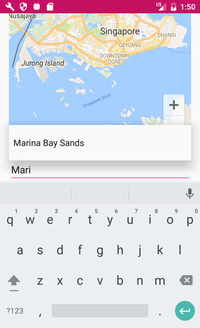
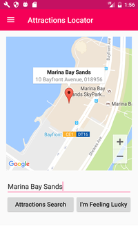
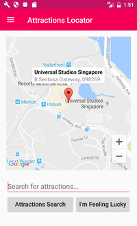
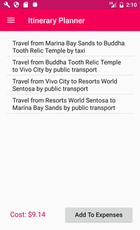
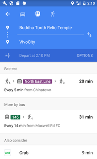
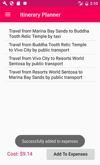
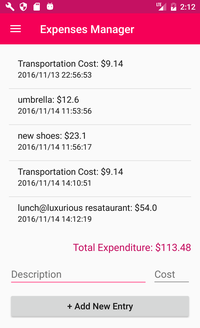

# Xplorer

Xplorer is a travel app that help Singapore tourists do itinerary planning,
locate popular attractions like Sentosa, and manage their trip expenses.

## App description

**1. Overview**

The welcome screen when our users open Xplorer for the first time. Users can draw out the menu from the
left-hand side of the app screen to access menu.

**2. Atractions Locator**

Users can search for location by entering their search term into the search bar. With the help from our AutoComplete
suggestions and robust Spell-checker, users can easily identify a tourist attraction and search for it on the Map. Another
feature is "I'm Feeling Lucky", inspired by Google Search, which gives users a random attraction to visit in case they still
have time but no further plan.

**3. Itinerary Planner**

After locating attractions that they want to visit, our users can move on to planning an itinerary with help from our
Itinerary Planner. It accepts users' inputs of their budget and attractions that they want to visit for a specific itinerary.
Our Itinerary Planner will then calculate the fastest and cheapest way based on the inputs, including decisions of the order in which users
visit, modes of transportation. Our Planner is fast and efficient enough to make travel itinerary planning a thing of the past
for our users!

In addition, users can add this transportation cost to the expenditure tracking provided by our Expenses Manger, which
will be introduced in the next section.

**4. Expenses Manager**

Last but not least, Xplorer has an Expenses Manager that helps users keep track of their
current spending on the trip. Users can add new entries, remove entries to the log of
the Expenses Manager. Thanks to the Expenses Manager, users will never have to worry
about overspending on their trip anymore!

## Technical in-depth features analysis

**1. Daily Itinerary Planning**
  - *Greedy Search*: We start by finding the fastest route assuming user take
  public transport from the start until the end, from there we find the time-optimised
  route by moving to the closest next destination (greedy approach)
  - *Cost Approximate*: 2 scenarios:
    - If there's still available budget for transportation, we will try to change mode of
    transportation to taxi, from the most efficient flip (measured by minutes-saved/extra-dollar)
    to the least efficient flip until budget cannot accommodate extra cost for taxi.
    - If the cost already exceeds allowed budget, we will try to change mode of
    transportation to walking, from the most efficient flip (measured by dollar-saved/extra-minute)
    to the least efficient flip until it fits right in budget.

**2. Tourist Attraction Locator**
  - *Fuzzy Regular Expression*: Our search make use of the open-source Java library
  for Fuzzy Regular Expression FREJ to make close-enough predictions in case of user typo(s).
  (e.g. "sentoszza" as refering to "Sentosa")
  - *Auto-Complete Text Field*: We also made use of auto-complete text field to give hints to
  our users to make the search more robust.

**3. Expenses Manager**
 - *JSON*: We made use of JSON (JavaScript Object Notation) to locally save user entries (either directly
 from the expenses manager or the itinerary planner) to a centralised local Shared Preference.

## Future improvements

To further improve Xplorer, we will include more attractions, in Singapore and other countries. Another
improvement is to have Xplorer available in different languages to cater to a wider range of users/tourists.
We can also integrate real-time on-screen image translation service from Google to assist tourists. Our aim
is for it to be an all-in-one app for tourist around the world!

## Team members

- Dominic Ong
- Eric Teo
- Kevin Tan
- Shaun Yee
- Tasya Aditya Rukmana
- Stanley Nguyen The Hung

## Acknowledgement

*SUTD 50.001 Instructors*:
- Prof. Ngai-Man Cheung
- Prof. Jit Biswas
- Prof. Andrew Yoong
- Prof. Ng Geok See
